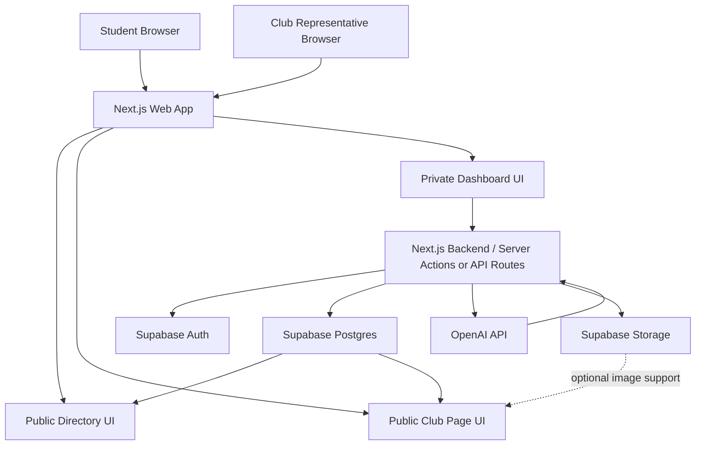
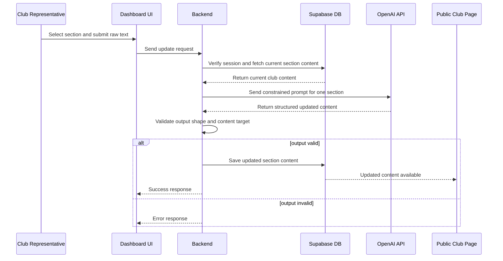
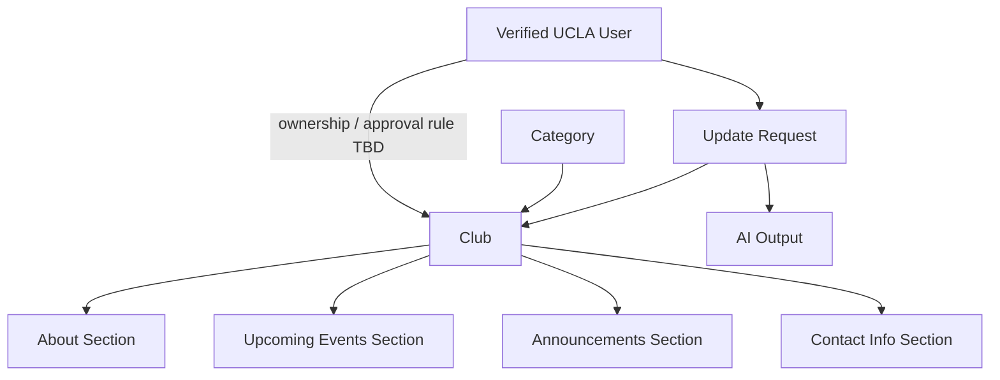

# BruinLink AI Product Requirements Document

**Status:** Draft for team alignment  
**Date:** April 22, 2026  
**Project Scope:** CS35L final class project MVP only

## 1. Document Purpose

This PRD defines the MVP product direction, system structure, and implementation boundaries for **BruinLink AI**, a UCLA club discovery and club-update platform.

This document is intentionally scoped to the final class project only. It does **not** attempt to define a long-term product roadmap beyond the MVP.

This document also distinguishes between:

- **Confirmed decisions** the team has already aligned on
- **Open questions** that still need discussion before final implementation

## 2. Product Summary

BruinLink AI is a web application with two equally important goals:

1. Help students discover UCLA clubs more easily through a centralized directory
2. Help club representatives keep their club pages current using a simple AI-assisted update workflow

The core idea is to replace fragmented, outdated club information with one centralized platform where:

- students can browse and search clubs
- clubs can maintain a public page without manually editing a website
- AI transforms raw club-submitted text into clean, section-specific website content

## 3. Problem Statement

UCLA students often struggle to find current information about campus organizations because club information is scattered across outdated websites, inconsistent social accounts, and informal communication channels.

At the same time, club leaders may not have the time or technical ability to maintain a polished website or structured content system.

The MVP solves this by:

- centralizing club discovery in one public-facing directory
- providing each club with a dedicated public page
- allowing club representatives to submit raw text through a form
- using a constrained LLM pipeline to convert that text into structured public-page updates

## 4. Product Vision for the MVP

The MVP should demonstrate the following end-to-end story:

1. A student lands on the BruinLink AI homepage
2. The student browses clubs alphabetically, filters by category, and searches by club name
3. The student opens a club page and sees clean, organized information
4. A club representative logs in through UCLA email verification
5. The representative submits an update form for a specific section of their club page
6. The AI processes the submission and updates that section automatically
7. The updated text appears on the public-facing club page

If the project successfully demonstrates that loop, the MVP has delivered its primary value proposition.

## 5. Product Goals

### Primary Goals

- Provide a centralized public directory of UCLA clubs
- Allow students to filter clubs by category
- Allow students to search clubs by name
- Provide each club with a dedicated public page
- Allow a club representative to update club content through a simple form
- Use AI to transform submitted raw text into clean public-page content
- Publish successful AI-generated text updates immediately

### Secondary Goals

- Support club image uploads if time allows
- Leave space for future ingestion of PDFs, links, or other external sources

### Non-Goals for This MVP

- Student accounts
- Favorites or personalized saved club lists
- Multi-admin club management
- Rich manual page editing outside the AI update flow
- Full long-term club governance workflows
- Social media scraping
- Complex event management systems
- AI-driven layout generation

## 6. Target Users

### User Type 1: Students

Students are public users who need a simple way to discover organizations and view current club information.

Student MVP needs:

- no account required
- public homepage directory
- category filtering
- club-name search
- public club pages

### User Type 2: Club Representatives

Club representatives are authenticated users who need a low-friction way to maintain a club page.

Club representative MVP needs:

- UCLA email registration and verification flow
- private dashboard
- ability to submit updates by section
- immediate AI-assisted updates to their club page

## 7. Confirmed Product Decisions

The following decisions are considered settled for this MVP:

- Student discovery and club update automation are equally important
- This PRD is for the final class project MVP only
- Students do not need accounts in the MVP
- Club pages should contain these core sections:
  - About
  - Upcoming Events
  - Announcements
  - Contact Information
- Upcoming Events and Announcements are treated as **simple text sections** in the MVP, not repeatable cards or structured event systems
- Club pages should begin from a **blank template**
- Club updates should come from a **manual form**
- The user should select the section being updated
- The AI should only rewrite content **within the selected section**
- The public club page should be rendered from **database content**, not by having the AI directly modify frontend code or page files
- AI updates should publish immediately after successful validation
- If AI output is invalid or malformed, the previous content must remain unchanged and the user should receive an error
- Manual direct editing is out of scope for the MVP
- Image support is in scope only as a **secondary, time-permitting extension**
- Search by club name is included in the MVP
- When the directory filter is set to "All," clubs should appear alphabetically
- Categories should not be hard-coded in this PRD yet because the initial category set is still undecided
- LangChain is not required for the MVP; a simpler direct LLM pipeline is preferred

## 8. Open Questions That Still Need Team Alignment

These items are intentionally left unresolved and should remain explicit in the PRD.

### 8.1 Club Ownership Verification

The team has not yet fully defined how the platform should verify that a UCLA email user is actually authorized to manage a given club.

Open questions:

- Should any verified UCLA email be allowed to create a club page?
- Should one club be tied to exactly one owner account in the MVP?
- Should one person be limited to one club?
- How should duplicate or fraudulent club claims be handled?

### 8.2 Club Approval Model

The team has not yet finalized whether new clubs should require admin review.

Open questions:

- Should club creation be automatic after UCLA email verification?
- Should club creation require manual team/admin approval?
- Should only suspicious or duplicate-looking submissions require manual review?

### 8.3 Category Definitions

The team wants category filtering, but the exact category set is not yet finalized.

Open questions:

- What categories should be included in the initial MVP?
- Who chooses or maintains the category list?
- Can a club belong to more than one category, or exactly one?

## 9. MVP Functional Requirements

### 9.1 Public Directory

The homepage should serve as the public directory of clubs.

Requirements:

- display the list of available clubs
- support category filtering
- support club-name search
- show clubs alphabetically when the filter is set to "All"
- allow a user to open a dedicated public page for a specific club

Design note:

The exact homepage visual treatment is intentionally flexible. The directory may be presented as cards, buttons, tiles, or another browseable UI pattern depending on the final design work.

### 9.2 Public Club Page

Each club should have a dedicated public page at a unique route, likely based on a slug.

Required sections:

- About
- Upcoming Events
- Announcements
- Contact Information

The page should render content from the database and update when backend content changes.

### 9.3 Club Registration and Login

The MVP should support a UCLA email-based registration flow for club representatives.

Minimum registration fields:

- club name
- owner UCLA email
- category
- short about/description
- contact email

Authentication expectations:

- user submits a `@ucla.edu` or `@g.ucla.edu` email
- system sends a verification code
- user enters the verification code
- verified users can access the private dashboard

Important note:

UCLA email verification alone does **not** fully solve real club-ownership verification. That issue remains an open product question.

### 9.4 Private Club Dashboard

The club dashboard MVP should contain:

- current club info
- a section-based update form
- a basic preview of the public club page or current public content

No advanced admin tooling is required in the MVP beyond what is necessary to demonstrate the core update flow.

### 9.5 Club Update Form

The update form should stay intentionally constrained to reduce ambiguity and simplify AI processing.

Required form behavior:

- club owner selects the section to update
- club owner enters raw text or notes
- optional event date/time fields may be included when relevant
- optional contact or social link fields may be included when relevant
- form is submitted to the backend for processing

### 9.6 AI Update Behavior

The AI system should:

- receive the selected section
- receive the raw club input
- receive the current content for that section
- generate revised content for that section only
- return content in a structured, machine-parseable format

The AI system should not:

- modify multiple sections at once in the MVP
- change page layout
- directly edit frontend code
- decide ownership permissions

### 9.7 Publishing Rules

For the MVP:

- successful validated AI output should be published immediately
- unsuccessful or malformed output should not overwrite existing content
- the previous content should remain the source of truth on failure

### 9.8 Image Support

Image support is a secondary feature if time allows.

If implemented:

- club owners may upload image files
- images should be stored in Supabase Storage
- public club pages may display them in a simple gallery or section

If time does not allow:

- the MVP should still be considered successful without image support

## 10. MVP User Flows

### 10.1 Student Discovery Flow

1. Student lands on homepage
2. Student views all clubs alphabetically
3. Student filters by category and/or searches by club name
4. Student selects a club
5. Student views the public club page

### 10.2 Club Registration Flow

1. User enters UCLA email and club registration details
2. System sends verification code
3. User verifies email
4. System grants dashboard access
5. Final club ownership/approval behavior remains subject to open product decisions

### 10.3 Club Update Flow

1. Club representative signs in
2. Representative opens dashboard
3. Representative selects a page section
4. Representative submits raw text and optional related fields
5. Backend verifies identity and club access
6. LLM rewrites content for that section only
7. Backend validates output
8. Valid output is saved to database
9. Public page reflects the new content

## 11. Product Architecture Principles

The MVP should follow these principles:

- **Keep the AI constrained.** The system should use AI for targeted content transformation, not open-ended autonomous behavior.
- **Use structured storage.** The website should render from database fields, not AI-generated source code.
- **Prefer the shortest reliable path.** Use the simplest architecture that supports the demo and preserves correctness.
- **Preserve content integrity.** Invalid AI output must never corrupt existing club content.
- **Separate confirmed decisions from unresolved policy questions.** The implementation should not hide unresolved club-verification issues.

## 12. Recommended Technical Stack

### Frontend

- Next.js
- React

### Backend / Platform

- Supabase Auth
- Supabase Postgres
- Supabase Storage for optional image support

### AI Layer

- OpenAI API

### Recommendation on Orchestration

For the MVP, use a **simple structured LLM pipeline** rather than a heavy agent framework.

Recommended approach:

- direct backend call to the OpenAI API
- constrained prompt per section
- structured output contract
- backend validation before database write

LangChain is optional and not required for this MVP.

## 13. High-Level System Architecture



### Architecture Notes

- The frontend is responsible for public browsing, search, filtering, and dashboard submission
- Supabase Auth handles UCLA email verification
- Supabase Postgres stores club records and page content
- OpenAI processes section-specific text transformations
- Supabase Storage is only needed if image support is implemented

## 14. AI Update Pipeline

The AI layer should not be treated as an autonomous website editor. It should be treated as a bounded transformation step in the backend.

### Pipeline Steps

1. Club representative submits the update form
2. Backend verifies user session and club access
3. Backend fetches:
   - club identity
   - selected section
   - current content for that section
4. Backend constructs a constrained prompt
5. LLM returns structured updated content for the selected section only
6. Backend validates the response
7. If valid, backend writes the new content to the database
8. If invalid, backend rejects the write and preserves existing content

### Output Shape Recommendation

The LLM should return a tightly scoped payload, for example:

```json
{
  "section": "announcements",
  "updated_text": "Revised text for the announcements section."
}
```

This is intentionally simple. For the MVP, the system should prefer predictable structured output over expressive but hard-to-validate responses.

## 15. AI Update Sequence Diagram



## 16. Route and Surface Map

This is a suggested logical structure, not a locked implementation detail.

### Public Routes

- `/` - homepage club directory
- `/clubs/[slug]` - public club page

### Auth / Private Routes

- `/register` - club registration
- `/verify` - verification code entry
- `/dashboard` - private club dashboard

### Logical Backend Operations

- create registration request
- verify UCLA email code
- fetch public club directory
- fetch single club page by slug
- submit section update request
- validate and persist AI output

## 17. Data Structure Recommendation

The MVP should keep the data model simple and aligned with the confirmed product decisions.

### Core Entities

**Users**

- authenticated UCLA-email users
- used for private dashboard access
- final ownership rules remain unresolved

**Clubs**

- club name
- slug
- category reference
- short description
- contact email
- public visibility state

**Club Sections**

- per-club content for:
  - about
  - upcoming events
  - announcements
  - contact info

**Categories**

- configurable set of club categories
- exact initial values still TBD

**Update Requests / Update Logs**

- submitted section
- raw input
- AI output
- timestamp
- submitting user
- success/failure status

This log is useful for debugging, demo review, and understanding how content changed over time.

## 18. Data Relationship Diagram



### Data Modeling Notes

- The ownership relationship is intentionally shown as **TBD** because club-governance rules are not finalized
- Categories should likely be represented as data rather than hard-coded UI-only values
- Club page content should remain section-based for simplicity
- Upcoming Events and Announcements stay as text fields in the MVP

## 19. Security and Access Considerations

### Required Security Behaviors

- only verified UCLA emails may access the private club dashboard
- public club browsing requires no authentication
- backend must validate session identity on every private update request
- backend must validate that a user is allowed to update the target club before writing content

### Important Product Risk

UCLA email verification proves UCLA affiliation, but it does not automatically prove club ownership. This is a major unresolved product and trust issue and should be treated as an explicit open question, not silently assumed away.

## 20. Reliability and Correctness Requirements

The MVP should favor correctness over complexity.

Required behaviors:

- AI output must be constrained to one selected section
- AI output must be validated before write
- invalid AI responses must not overwrite existing content
- the public page must read from persisted database state
- search and filtering should operate against stored club metadata

## 21. Search and Filtering Requirements

The homepage directory should support:

- alphabetical browsing when viewing all clubs
- filtering by selected category
- searching by club name

The exact final UI treatment is flexible, but the underlying behavior should be deterministic and simple to demonstrate live.

## 22. Out-of-Scope but Reasonable Future Extensions

These items should not drive MVP architecture complexity, but the PRD acknowledges them as future extensions:

- PDF ingestion for club information
- link-based content ingestion
- image galleries
- student accounts
- favorites
- multi-admin club ownership
- admin moderation tools
- AI tone customization

## 23. Demo Success Criteria

The class-project MVP should be considered successful if the team can demonstrate all of the following:

1. The homepage loads a list of clubs
2. The list can be searched by club name
3. The list can be filtered by category
4. Clicking a club opens a dedicated public club page
5. A club representative can complete UCLA email verification
6. The club representative can access a dashboard
7. The representative can submit raw text for a selected section
8. The LLM processes that input and updates the selected section
9. The public club page reflects the new text after the update

Image support is a bonus, not a requirement for MVP success.

## 24. Recommended Implementation Priorities

To preserve the shortest reliable path to MVP, the build order should logically prioritize:

1. Public club directory and public club pages
2. UCLA email verification and dashboard access
3. Database-backed section content model
4. Section-based update form
5. Structured LLM update pipeline
6. Optional image support only after text updates work reliably

## 25. Final Recommendation Summary

BruinLink AI should be built as a **database-backed directory and content system with a constrained AI rewrite layer**, not as an autonomous page-generation platform.

For the MVP, the team should prioritize:

- a clean public discovery experience
- a minimal but functional club dashboard
- one-section-at-a-time AI text updates
- explicit handling of unresolved club-verification policy questions

This gives the team the shortest path to a convincing, coherent final project while keeping the architecture logically correct and manageable.

## 26. Open Questions Summary

The following decisions still need team resolution before implementation is fully locked:

1. What exact rule determines who is allowed to claim and manage a club?
2. Does new club creation require admin approval, and if so when?
3. What is the initial category set?
4. Can a club belong to one category or multiple?
5. How should duplicates or suspicious club claims be handled?

These should be resolved as early as possible because they directly affect the authentication, data model, and trust model of the product.
