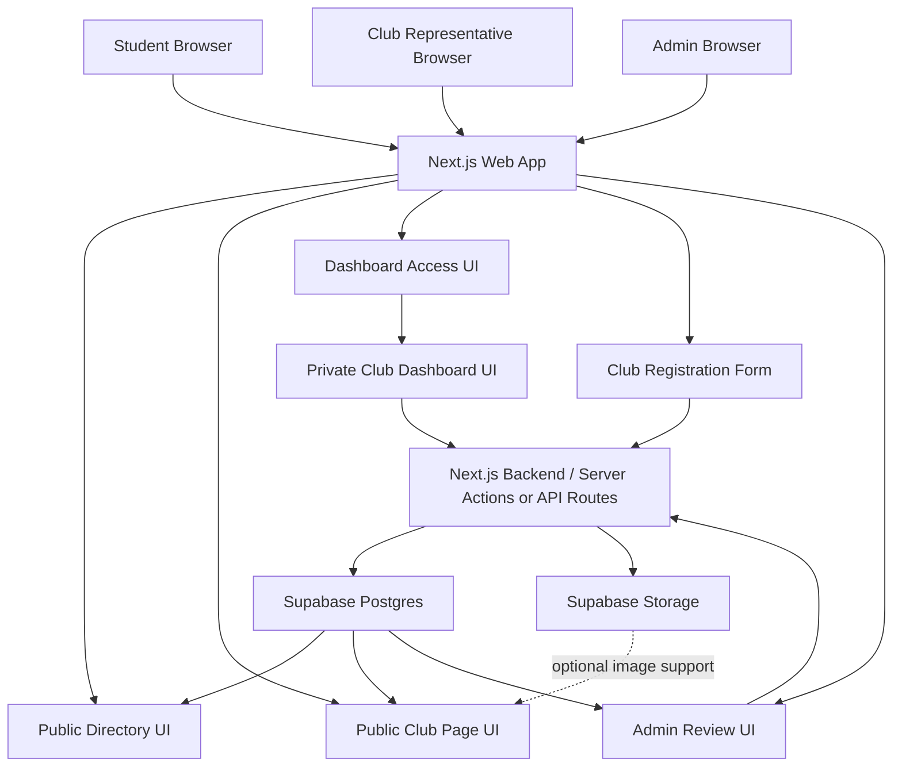
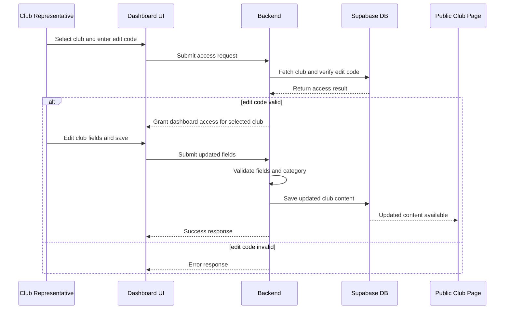
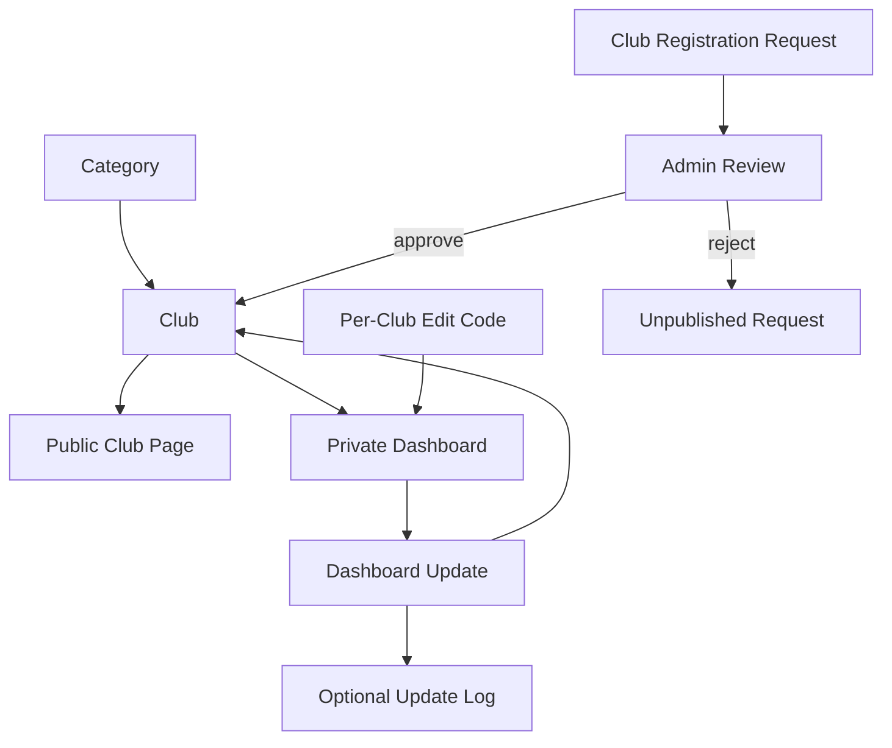

# BruinLink Product Requirements Document

**Status:** Revised draft for team alignment  
**Date:** April 28, 2026  
**Project Scope:** CS35L final class project MVP only

## 1. Document Purpose

This PRD defines the revised MVP product direction, system structure, and implementation boundaries for **BruinLink**, a UCLA club discovery and club-management platform.

This revision removes the previous AI-assisted rewrite workflow from the MVP because the team does not currently have reliable access to API keys for an LLM provider. The product should still preserve the original underlying goal: make UCLA club information easier for students to find and easier for club representatives to keep current.

This document is intentionally scoped to the final class project only. It does **not** attempt to define a long-term product roadmap beyond the MVP.

This document also distinguishes between:

- **Confirmed decisions** the team has already aligned on
- **Open questions** that still need discussion before final implementation
- **Future extensions** that may be revisited after the core MVP works

## 2. Product Summary

BruinLink is a web application with two core goals and one supporting control flow:

1. Help students discover UCLA clubs through a centralized public directory
2. Help club representatives keep their club pages current through a simple management dashboard
3. Let new clubs request a listing, while keeping publication behind admin approval

The core idea is to replace fragmented, outdated club information with one centralized platform where:

- students can browse, search, and filter clubs
- each club has a dedicated public profile page
- club representatives can update their club information without editing code
- new club listing requests can be reviewed before becoming public
- public club pages are rendered from structured database content

The revised MVP does **not** include AI-generated content. Club representatives manually edit structured page fields in a dashboard, and saved changes appear immediately on the public club page.

## 3. Problem Statement

UCLA students often struggle to find current information about campus organizations because club information is scattered across outdated websites, inconsistent social accounts, and informal communication channels.

At the same time, club leaders may not have the time or technical ability to maintain a polished website or structured content system.

The MVP solves this by:

- centralizing club discovery in one public-facing directory
- providing each club with a dedicated public page
- giving club representatives a simple dashboard for updating their own page content
- giving prospective club representatives a controlled way to request a new listing
- giving admins a simple approval gate before new clubs appear publicly
- storing club content in a database so public pages update without code changes

## 4. Product Vision for the MVP

The MVP should demonstrate the following end-to-end story:

1. A student lands on the BruinLink homepage
2. The student browses clubs alphabetically, filters by category, and searches by club name
3. The student opens a club page and sees clean, organized information
4. A club representative opens the dashboard access flow
5. The representative enters a club-specific edit code
6. The representative edits structured fields for their club page
7. The representative saves the changes
8. The updated information appears immediately on the public-facing club page

The MVP should also demonstrate a second bounded story:

1. A prospective club representative opens a club registration form
2. The representative submits club details and a responsible contact person
3. The request is stored as pending, not published immediately
4. An admin reviews the request from a protected admin page
5. The admin approves or rejects the request
6. Approved requests become public club records; rejected requests remain unpublished

If the project successfully demonstrates both loops, the MVP has delivered its primary value proposition.

## 5. Product Goals

### Primary Goals

- Provide a centralized public directory of UCLA clubs
- Allow students to filter clubs by category
- Allow students to search clubs by name
- Provide each club with a dedicated public page
- Allow a club representative to access a club-specific dashboard
- Allow a club representative to manually edit public club content
- Publish successful dashboard edits immediately to the public club page
- Allow prospective club representatives to submit new club listing requests
- Allow an admin to approve or reject pending club listing requests
- Prevent unapproved club requests from appearing in the public directory

### Secondary Goals

- Support club image or logo uploads if time allows
- Support a basic preview of the public club page from the dashboard
- Support email notification to an admin after a registration request if time allows
- Leave space for future UCLA email login and club-claim verification

### Non-Goals for This MVP

- AI-assisted rewriting
- OpenAI API integration
- LangChain or agent framework integration
- Student accounts
- Favorites or personalized saved club lists
- Multi-admin club management
- Admin moderation workflows beyond basic club request review and club visibility control
- Full club ownership verification
- Social media scraping
- Complex event management systems
- AI-driven layout generation

## 6. Target Users

### User Type 1: Students

Students are public users who need a simple way to discover organizations and view current club information.

Student MVP needs:

- no account required
- public homepage directory
- category filtering
- club-name search
- public club pages

### User Type 2: Club Representatives

Club representatives are users who need a low-friction way to maintain a public page for their club.

Club representative MVP needs:

- dashboard access for their specific club
- a simple access model that is feasible for a class-project MVP
- editable fields for public club information
- immediate publishing after saving valid changes

For the MVP, club representatives are authorized through a **per-club edit code**, not through full UCLA email authentication.

### User Type 3: Admins

Admins are project/team users who need to keep public club listings controlled.

Admin MVP needs:

- a protected admin page
- visibility into pending club registration requests
- approve and reject controls for pending requests
- the ability to remove or hide clubs from the public directory if needed
- no dependence on email delivery for the core approval flow

For the MVP, admin access may use a single admin password stored outside the codebase, such as an environment variable. This admin password is separate from club representative edit codes and should not grant public users edit access to every club page.

## 7. Confirmed Product Decisions

The following decisions are considered settled for this revised MVP:

- The project name should be **BruinLink**, not **BruinLink AI**
- Student discovery and club page management are the two core product pillars
- The MVP will not depend on LLM or AI API access
- Students do not need accounts in the MVP
- The public homepage should function as a club directory
- Clubs should be searchable by club name
- Clubs should be filterable by category
- When the directory filter is set to "All," clubs should appear alphabetically
- The initial category set should be:
  - engineering
  - computer science
  - business
  - cultural
  - other
- Each club should have a dedicated public page
- Club pages should contain these core sections:
  - About
  - Upcoming Events
  - Announcements
  - Contact Information
- Upcoming Events and Announcements are treated as **simple editable text sections** in the MVP, not repeatable event cards or structured event systems
- The dashboard should allow manual editing of club page content
- Successful dashboard edits should publish immediately
- Public club pages should render from database content, not static hard-coded page files
- The MVP should start with **pre-seeded club records** and support admin-approved club registration requests
- Public users may submit new club registration requests, but those requests must not become public clubs until an admin approves them
- A protected admin page should allow pending club requests to be approved or rejected
- The first admin page should also allow admins to hide or permanently delete existing clubs
- The registration form should collect a responsible contact person's name and email for admin review
- The registration form should not collect student ID in the baseline MVP unless the team or instructor explicitly requires it
- Club access should use a **per-club edit code** for the primary MVP
- Approved registration requests should automatically generate a unique random edit code in `BL-XXXX-XXXX` format, where each `X` is an uppercase letter or digit
- Admin request approval is distinct from club representative edit-code access
- Email notification after registration submission is optional; the admin page is the required MVP review surface
- A UCLA email login plus club claim code flow may be documented as a future or time-permitting extension
- Image support is in scope only as a **secondary, time-permitting extension**

## 8. Open Questions That Still Need Team Alignment

These items are intentionally left unresolved and should remain explicit in the PRD.

### 8.1 Seed Club List

The MVP should likely use pre-seeded club records, but the exact set of demo clubs still needs to be chosen.

Open questions:

- Which clubs should be included in the demo database?
- Should the seeded clubs be real UCLA clubs, fictional/sample clubs, or a mix?
- How many clubs are needed to make search and filtering feel convincing?

### 8.2 Edit Code Distribution

The MVP uses a per-club edit code, but the team should decide how to present this in the demo.

Open questions:

- Should each seeded club have a known demo edit code?
- Should edit codes be shown only in the demo script?
- Should the app include any visible "demo access" hints, or should codes be distributed outside the UI?

### 8.3 Image Support

Image support is still optional.

Open questions:

- Should the dashboard support logo upload?
- Should the dashboard support a gallery image upload?
- Should the MVP skip uploads entirely and use static/default images?

### 8.4 Admin Review Details

The MVP now includes admin-reviewed club registration requests, but some demo details still need team alignment.

Open questions:

- Who owns the final seeded club list for the demo?

## 9. MVP Functional Requirements

### 9.1 Public Directory

The homepage should serve as the public directory of clubs.

Requirements:

- display the list of available clubs
- support category filtering
- support club-name search
- show clubs alphabetically when the filter is set to "All"
- allow a user to open a dedicated public page for a specific club

Design note:

The exact homepage visual treatment is intentionally flexible. The directory may be presented as cards, rows, tiles, or another browseable UI pattern depending on the final design work.

### 9.2 Public Club Page

Each club should have a dedicated public page at a unique route, likely based on a slug.

Required content:

- club name
- category
- short description
- About
- Upcoming Events
- Announcements
- Contact Information

The page should render content from the database and update when backend content changes.

### 9.3 Dashboard Access With Per-Club Edit Code

The MVP should support a simple access flow for club representatives using a per-club edit code.

Expected behavior:

- user opens the dashboard access page
- user selects or enters the club they want to manage
- user enters that club's edit code
- backend verifies that the submitted edit code matches the selected club
- if valid, the user receives access to edit only that club
- if invalid, the user receives an error and no dashboard access

Important note:

A per-club edit code is a pragmatic MVP access model. It does **not** prove UCLA affiliation or real-world club ownership. The PRD should be explicit about that limitation instead of pretending the issue is fully solved.

### 9.4 Private Club Dashboard

The club dashboard MVP should contain:

- current club info
- editable fields for public club content
- save/update controls
- a basic preview of the public club page or current public content

The dashboard should only expose the club associated with the verified edit code.

### 9.5 Club Editing Form

The editing form should stay intentionally straightforward.

Required editable fields:

- club name
- category
- short description
- About
- Upcoming Events
- Announcements
- Contact Information

Optional editable fields, if time allows:

- logo image
- gallery image
- external website link
- Instagram or social link

### 9.6 Publishing Rules

For the MVP:

- successful dashboard edits should be saved to the database immediately
- the public club page should reflect saved changes immediately
- invalid form submissions should not overwrite existing content
- required fields should be validated before saving

### 9.7 Image Support

Image support is a secondary feature if time allows.

If implemented:

- club representatives may upload image files
- images should be stored in Supabase Storage
- public club pages may display a logo, hero image, or simple gallery

If time does not allow:

- the MVP should still be considered successful without image upload support

### 9.8 Club Registration Request

The homepage should provide a clear entry point for prospective club representatives to request a new club listing.

The registration form should create a pending request, not a public club.

Required request fields:

- responsible contact person's name
- responsible contact person's email
- club name
- category
- short description
- About
- meeting time
- meeting location
- public student contact email

Optional request fields, if time allows:

- Upcoming Events
- Announcements

Fields should be validated before submission. Invalid submissions should not create pending requests.

### 9.9 Admin Review Page

The MVP should include a protected admin page for reviewing club registration requests.

Required behavior:

- admin enters the admin password before viewing requests
- pending requests are listed with all submitted fields
- admin can approve a pending request
- admin can reject a pending request
- rejection notes are optional
- approved requests create public club records with blank Upcoming Events and Announcements sections
- approved requests automatically generate a unique random edit code in `BL-XXXX-XXXX` format
- the generated plaintext edit code is shown to the admin once so it can be distributed to the responsible contact
- rejected requests remain unpublished
- admin can hide existing clubs from the public directory
- admin can permanently delete existing clubs
- public directory and public club pages show only approved, visible clubs

Optional behavior, if time allows:

- admin can add an internal review note
- admin receives an email notification when a new request is submitted

## 10. MVP User Flows

### 10.1 Student Discovery Flow

1. Student lands on homepage
2. Student views all clubs alphabetically
3. Student filters by category and/or searches by club name
4. Student selects a club
5. Student views the public club page

### 10.2 Club Dashboard Access Flow

1. Club representative opens the dashboard access page
2. Representative selects or enters their club
3. Representative enters the club-specific edit code
4. Backend validates the edit code for that club
5. Representative receives dashboard access for that club only

### 10.3 Club Update Flow

1. Club representative accesses the dashboard
2. Representative edits one or more club profile fields
3. Representative saves the form
4. Backend validates the submitted fields
5. Valid content is saved to the database
6. Public club page reflects the updated content

### 10.4 Club Registration Request Flow

1. Prospective club representative opens the homepage registration entry point
2. Representative fills out required club and contact fields
3. Representative submits the form
4. Backend validates the submitted fields
5. Valid request is stored with status `pending`
6. The request does not appear in the public directory

### 10.5 Admin Approval Flow

1. Admin opens the protected admin page
2. Admin enters the admin password
3. Backend validates admin access
4. Admin reviews pending club registration requests
5. Admin approves or rejects a request
6. Approved request becomes a public club record
7. Rejected request remains unpublished

## 11. Product Architecture Principles

The MVP should follow these principles:

- **Use structured storage.** The website should render from database fields, not hard-coded page content.
- **Prefer the shortest reliable path.** Use the simplest architecture that supports the demo and preserves correctness.
- **Make the access model explicit.** Per-club edit codes are an MVP simplification, not a complete real-world ownership solution.
- **Gate new public records.** Public users may request club listings, but only admins may publish them.
- **Avoid unnecessary dependencies.** The MVP should not depend on AI APIs, LLM orchestration, or email infrastructure unless the team later chooses to add them.
- **Preserve content integrity.** Invalid submissions must not corrupt existing club content.
- **Separate confirmed decisions from future extensions.** The implementation should not hide unresolved club-verification issues.

## 12. Recommended Technical Stack

### Frontend

- Next.js
- React

### Backend / Platform

- Supabase Postgres
- Supabase Storage for optional image support

### Authentication / Access Model

Primary MVP approach:

- per-club edit codes verified by the backend
- dashboard access scoped to the selected club
- admin password for the protected request review page
- admin approval required before new registration requests become public clubs

Future or time-permitting approach:

- Supabase Auth with UCLA email verification
- club claim code to connect a verified user to a pre-seeded club
- email notification when a registration request is submitted

## 13. High-Level System Architecture



### Architecture Notes

- The frontend is responsible for public browsing, search, filtering, registration forms, admin review surfaces, and dashboard forms
- Supabase Postgres stores club records, page content, categories, edit-code metadata, and club registration requests
- The backend validates edit codes, admin access, request submissions, and update submissions before writing content
- Public pages read only approved, visible club records from persisted database state
- Supabase Storage is only needed if image support is implemented

## 14. Dashboard Update Pipeline

The dashboard update flow should be a bounded database update, not a content-generation pipeline.

### Pipeline Steps

1. Club representative enters dashboard access information
2. Backend verifies the selected club and edit code
3. Dashboard loads the current club content
4. Representative edits structured fields
5. Representative submits the form
6. Backend validates required fields and allowed category values
7. If valid, backend writes the updated content to the database
8. If invalid, backend rejects the write and preserves existing content

### Example Update Payload

The backend should receive predictable form data, for example:

```json
{
  "club_id": "club_123",
  "category": "computer science",
  "short_description": "A community for students interested in software engineering.",
  "about": "Updated about text.",
  "upcoming_events": "General meeting this Thursday.",
  "announcements": "Applications are open.",
  "contact_info": "Email bruinclub@g.ucla.edu."
}
```

## 15. Dashboard Update Sequence Diagram



## 16. Route and Surface Map

This is a suggested logical structure, not a locked implementation detail.

### Public Routes

- `/` - homepage club directory
- `/clubs/[slug]` - public club page
- `/register` or a homepage modal - public club registration request form

### Dashboard Routes

- `/dashboard` - dashboard access page
- `/dashboard/[clubSlug]` - private club dashboard after valid access

### Admin Routes

- `/admin` - protected admin page for reviewing club registration requests

### Logical Backend Operations

- fetch public club directory
- fetch single club page by slug
- submit club registration request
- verify admin password/session
- fetch pending club registration requests
- approve club registration request
- reject club registration request
- hide an existing club
- permanently delete an existing club
- verify club edit code
- fetch editable club dashboard data
- submit club profile update
- validate and persist edited content
- upload optional club image

## 17. Data Structure Recommendation

The MVP should keep the data model simple and aligned with the confirmed product decisions.

### Core Entities

**Clubs**

- id
- name
- slug
- category
- short description
- about
- upcoming events
- announcements
- contact information
- public visibility state
- optional logo/image URL
- edit code hash
- last edited timestamp
- created timestamp
- updated timestamp

Visibility state should support at least:

- visible
- hidden

**Club Registration Requests**

- id
- responsible contact name
- responsible contact email
- club name
- derived club slug
- requested category
- short description
- about
- meeting time
- meeting location
- public student contact email
- optional verification link or notes
- optional upcoming events
- optional announcements
- status: pending, approved, or rejected
- admin review note
- reviewed timestamp
- created timestamp
- updated timestamp

**Categories**

- fixed MVP category set:
  - engineering
  - computer science
  - business
  - cultural
  - other

Categories may be represented as a database table or as a constrained enum/list, as long as filtering behavior is deterministic.

**Update Logs**

- club id
- submitted fields
- timestamp
- success/failure status

An update log is optional but useful for debugging, demo review, and understanding how content changed over time.

### Data Modeling Notes

- The MVP can store club page sections directly on the club record or in a separate `club_sections` table
- For the shortest path, storing the required sections directly on the club record is acceptable
- The current Supabase implementation stores the required page sections directly on the `clubs` row
- The current Supabase implementation uses two primary tables: `clubs` and `club_registration_requests`
- The current Supabase implementation constrains categories and request/visibility/status values at the database level
- The edit code should not be stored as plain visible text in production-like code; storing a hash is preferred if feasible
- Club registration requests should be stored separately from public club records until approval
- Approved requests should create a club record in the same shape used by seeded clubs
- Approved requests should generate a random edit code in `BL-XXXX-XXXX` format and store only its hash
- Approved requests should initialize Upcoming Events and Announcements as blank sections
- Rejected requests should remain unavailable to the public directory and public club pages

## 18. Data Relationship Diagram



## 19. Security and Access Considerations

### Required Security Behaviors

- public club browsing requires no authentication
- dashboard access requires the correct per-club edit code
- backend must validate the edit code before allowing dashboard writes
- dashboard writes must be scoped to the selected club only
- invalid edit codes must not expose editable club data
- invalid form submissions must not overwrite existing content
- public club registration submissions must create pending requests only
- pending and rejected club registration requests must not appear publicly
- admin review actions require the admin password or a validated admin session
- the admin password must not be committed to the repository
- the Supabase service-role key must stay server-only and must not be exposed through `NEXT_PUBLIC_` variables or client components
- public Supabase access should be limited to public-safe reads, such as visible club records
- privileged admin writes should run through server actions after admin-session validation
- plaintext edit codes must not be stored in the database
- forgotten club edit codes should be recovered by admin-triggered regeneration, not by retrieving old plaintext codes
- existing club deletion from the admin page is permanent and should require confirmation

### Current MVP Access Implementation

- Public directory and club-page reads use the Supabase anon key and row-level security.
- Public reads only return clubs whose `visibility_state` is `visible`.
- Registration submissions are validated by a server action and stored as pending `club_registration_requests`.
- Admin password verification creates an HTTP-only admin session cookie for the admin page.
- Admin approve, reject, hide, and delete actions use a server-only Supabase service-role client after admin-session validation.
- Approval is handled by a database RPC so club creation and request approval happen as one database operation.
- Approval returns the plaintext `BL-XXXX-XXXX` edit code to the admin UI once, while storing only the hash in the database.
- Admin edit-code regeneration creates a new unique `BL-XXXX-XXXX` code, replaces the stored hash, and returns the new plaintext code to the admin UI once. The previous code stops working immediately.

### Important Product Risk

A per-club edit code does not prove real-world club ownership. It only proves that the user knows the code for that club.

This is acceptable for the CS35L MVP if the product is presented honestly as a simplified demo access model. A stronger ownership model can be added later through UCLA email verification and club claim codes.

### Avoided Security Shortcut

The MVP should avoid a single global admin password that unlocks every club. A global password would make the demo simpler but would weaken the product logic because every dashboard user could edit every club.

Per-club edit codes preserve a clearer relationship:

```text
one club -> one edit code -> one dashboard scope
```

The protected admin page is a separate system-level surface. It may use one admin password for the class-project MVP because it is explicitly for team-admin review and control, not for club representatives editing arbitrary clubs.

## 20. Reliability and Correctness Requirements

The MVP should favor correctness over complexity.

Required behaviors:

- dashboard access must be limited to the club associated with the valid edit code
- saved dashboard edits must persist in the database
- public pages must read from persisted database state
- invalid form submissions must not overwrite existing content
- club registration requests must be validated before becoming pending records
- pending and rejected registration requests must not affect public search/filter results
- approving a request should create exactly one public club record
- approving a request should create exactly one unique edit code in `BL-XXXX-XXXX` format
- hiding a club should remove it from public reads without deleting the club row
- deleting a club should permanently remove the selected club
- search and filtering should operate against stored club metadata
- categories should be constrained to the five confirmed MVP categories

## 21. Search and Filtering Requirements

The homepage directory should support:

- alphabetical browsing when viewing all clubs
- filtering by selected category
- searching by club name

The MVP category set is:

- engineering
- computer science
- business
- cultural
- other

The exact final UI treatment is flexible, but the underlying behavior should be deterministic and simple to demonstrate live.

## 22. Out-of-Scope but Reasonable Future Extensions

These items should not drive MVP architecture complexity, but the PRD acknowledges them as future extensions:

- UCLA email login through Supabase Auth
- club claim code flow that links a verified UCLA email to a club
- full club ownership verification
- club creation from the dashboard
- multi-admin roles and permissions
- automated email approval links
- student accounts
- favorites
- multi-admin club ownership
- admin moderation tools
- image galleries
- PDF ingestion for club information
- link-based content ingestion
- AI-assisted rewriting if reliable API access becomes available later

## 23. Future Extension: UCLA Email Login Plus Club Claim Code

The team may implement this only after the primary edit-code MVP works.

Conceptual flow:

1. Club representative logs in with a UCLA email through Supabase Auth
2. Representative selects a pre-seeded club
3. Representative enters that club's private claim code
4. Backend verifies the code
5. Backend links the authenticated user to the club
6. Future dashboard sessions use the Supabase user identity instead of repeatedly asking for the edit code

This extension would improve realism because it verifies UCLA affiliation and creates a persistent relationship between a user and a club. However, it should not block the primary MVP.

## 24. Demo Success Criteria

The class-project MVP should be considered successful if the team can demonstrate all of the following:

1. The homepage loads a list of clubs
2. The list can be searched by club name
3. The list can be filtered by category
4. Clicking a club opens a dedicated public club page
5. A club representative can access a dashboard using a club-specific edit code
6. The dashboard shows editable content for that club only
7. The representative can edit and save club profile fields
8. The public club page reflects the saved changes immediately
9. A prospective club representative can submit a new club registration request
10. An admin can review, approve, or reject the request
11. An approved request appears as a public club; rejected and pending requests do not
12. Approved requests produce a unique `BL-XXXX-XXXX` edit code for admin distribution
13. Admin can hide or permanently delete an existing club

Image support and UCLA email login are bonuses, not requirements for MVP success.

## 25. Recommended Implementation Priorities

To preserve the shortest reliable path to MVP, the build order should logically prioritize:

1. Public club directory and public club pages
2. Supabase database schema and seeded club records
3. Category search/filter behavior
4. Club registration request form and pending request storage
5. Protected admin review page with approve/reject/hide/delete controls
6. Per-club edit code verification
7. Private dashboard or edit mode for editing one club
8. Immediate database-backed publishing
9. Optional image support
10. Optional UCLA email login plus club claim code

## 26. Final Recommendation Summary

BruinLink should be built as a **database-backed UCLA club directory and club-management dashboard**, not as an AI content-generation platform.

For the MVP, the team should prioritize:

- a clean public discovery experience
- deterministic category filtering and club-name search
- public club pages rendered from database content
- a simple per-club edit-code access model
- a dashboard for manual club profile updates
- admin-reviewed new club registration requests
- immediate publishing after successful saves

This gives the team the shortest path to a convincing, coherent final project while keeping the architecture logically correct and manageable.

## 27. Open Questions Summary

The following decisions still need team resolution before implementation is fully locked:

1. Which clubs should be included in the seeded demo data?
2. Should seeded clubs be real, fictional, or mixed?
3. How should demo edit codes be distributed during presentation?
4. Should image upload be included or skipped for the final demo?
5. Should update logs be implemented, or skipped to keep the MVP smaller?
