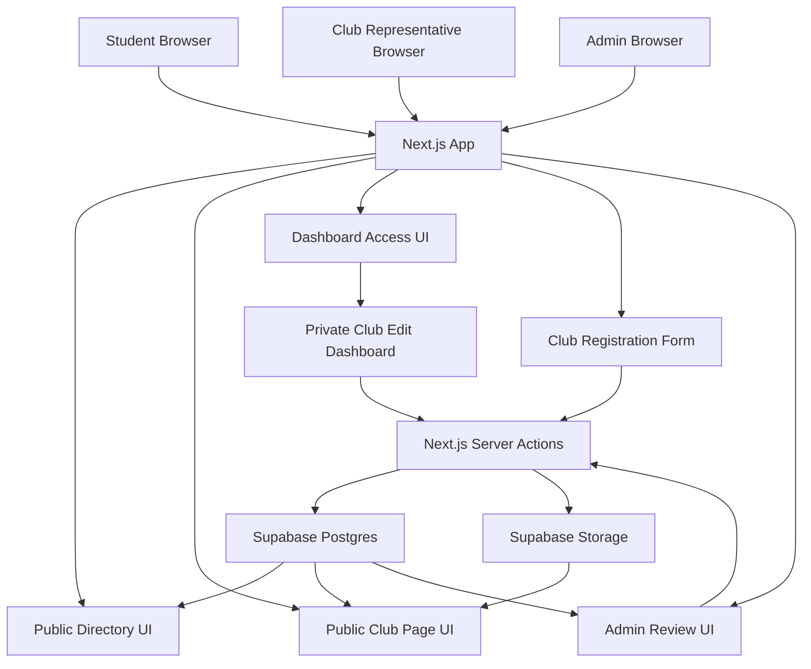
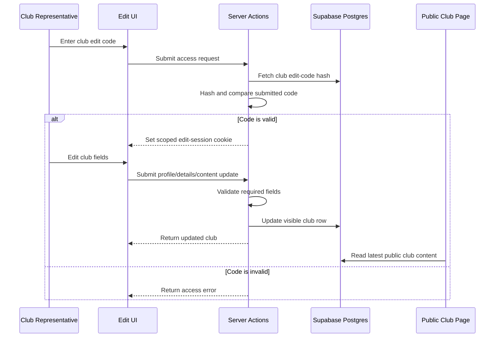
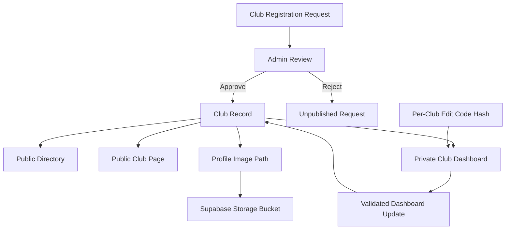

# BruinLink

BruinLink is a CS35L MVP for UCLA club discovery and lightweight club listing management. It gives students a public club directory, lets prospective club representatives request new listings, gives admins a protected review dashboard, and lets approved clubs update their own public page through a per-club edit code.

The project is intentionally scoped as a database-backed MVP. It does not depend on AI APIs, student accounts, or UCLA email authentication.

## What Works

- Public homepage directory backed by Supabase club records
- Club-name search and category filtering
- Dedicated public club pages at `/clubs/[slug]`
- Freshness labels derived from `last_edited_at`
  - `fresh`: updated within 3 days
  - `current`: updated more than 3 days ago and within 14 days
  - `needs update`: updated more than 14 days ago
- Public club registration requests at `/register`
- Protected admin review at `/admin`
- Admin approve/reject flow for pending requests
- Admin hide, unhide, permanent delete, search, visibility filter, and freshness filter
- Automatic unique edit code generation in `BL-XXXX-XXXX` format
- Hashed edit-code storage only; plaintext codes are shown once to admins
- Admin-triggered edit-code regeneration for forgotten club codes
- Per-club edit mode at `/clubs/[slug]/edit`
- Editable club profile, meeting details, listed members, contact email, upcoming events, and announcements
- Club profile image upload path backed by Supabase Storage
- Immediate public-page updates after a successful club edit

## Routes

- `/` - public club directory
- `/clubs/[slug]` - public club profile
- `/clubs/[slug]/edit` - protected edit page for one club
- `/register` - new club listing request form
- `/admin` - protected admin review and club management page

## Tech Stack

- Next.js App Router
- React
- TypeScript
- Supabase Postgres
- Supabase JavaScript client
- Tailwind CSS through the Next/Tailwind setup
- Lucide icons

## Local Setup

### Prerequisites

- Node.js and npm
- Access to a Supabase project, or the Supabase CLI for local database work
- The project environment values listed below

### 1. Install Dependencies

```bash
npm install
```

### 2. Configure Environment Variables

Create a `.env` file from `.env.example`:

```bash
cp .env.example .env
```

Required values:

```bash
BRUINLINK_ADMIN_PASSWORD=
NEXT_PUBLIC_SUPABASE_URL=
NEXT_PUBLIC_SUPABASE_ANON_KEY=
SUPABASE_SERVICE_ROLE_KEY=
```

Notes:

- `BRUINLINK_ADMIN_PASSWORD` protects `/admin`.
- `NEXT_PUBLIC_SUPABASE_URL` and `NEXT_PUBLIC_SUPABASE_ANON_KEY` are used for public-safe reads.
- `SUPABASE_SERVICE_ROLE_KEY` is server-only and is used for privileged admin/club edit server actions.
- Never commit `.env` or real Supabase secrets.

### 3. Prepare Supabase

The schema is defined in:

```bash
supabase/migrations/20260513090000_init_bruinlink_schema.sql
```

The migration creates:

- `clubs`
- `club_registration_requests`
- request approval RPC
- row-level security for public visible-club reads
- seeded demo club records

Apply the migrations using the Supabase workflow your team is using. For a linked project, the usual command is:

```bash
supabase db push
```

The app also expects a Supabase Storage bucket named:

```bash
club-profile-images
```

This bucket is used for club profile images shown on directory cards, public club pages, and admin review. The current UI reads image URLs with `getPublicUrl`, so the bucket should be public for the submitted image paths to render in the browser.

### 4. Run the App Locally

```bash
npm run dev
```

Open:

```bash
http://localhost:3000
```

If port `3000` is busy:

```bash
npm run dev -- --port 3001
```

Then open:

```bash
http://localhost:3001
```

### 5. Verify Before Submitting

Run these checks before final submission:

```bash
npm run lint
npx tsc --noEmit
npm run build
```

If the team adds automated end-to-end tests, include and run that command here as well.

## Architecture

### System Overview

BruinLink is a Next.js app with browser-facing routes for students, club representatives, and admins. Public reads use the Supabase anon key and row-level security. Mutating flows go through server actions that use the service-role key after checking either an admin session or a club-specific edit session.



### Dashboard Update Flow

Club representatives do not edit files or static pages. They enter a per-club edit code, receive a scoped edit session, update structured fields, and the server action writes the validated update back to Supabase. Public pages then read the updated database content.



### Data Relationships

Club records are the source of truth for public pages. Registration requests stay separate until an admin approves them. Approval creates a visible club row, stores only a hashed edit code, and leaves rejected requests unpublished.



## Access Model

Admin access:

- Admins enter `BRUINLINK_ADMIN_PASSWORD` on `/admin`.
- A valid admin session is stored in an HTTP-only cookie for 4 hours.
- Changing `BRUINLINK_ADMIN_PASSWORD` invalidates existing admin session tokens after the app restarts.

Club edit access:

- Admin approval generates a unique `BL-XXXX-XXXX` edit code.
- The database stores only the hash of that code.
- Club representatives click `Manage listing` on their public club page and enter the code.
- A valid club edit session is scoped to that single club and lasts 4 hours.
- Regenerating a club code invalidates old edit sessions for that club.

## MVP Status

The core PRD success criteria are implemented:

- public club discovery
- search and category filtering
- public club pages
- database-backed registration requests
- protected admin review
- approve/reject/hide/unhide/delete
- generated edit codes
- per-club edit mode
- immediate publishing after saves

Remaining work before final submission:

- choose the final seeded/demo club list
- decide how demo edit codes will be distributed during presentation
- run one final end-to-end demo pass on the target Supabase project
- confirm the final lint, typecheck, build, and automated test commands
- optionally add update logs
- optionally replace edit codes with UCLA email login plus club-claim verification in a future version

## Documentation

- Product requirements: `BruinLink-PRD.md`
- Implementation plan/source of truth: `docs/plans/club-registration-admin-review-plan.md`
